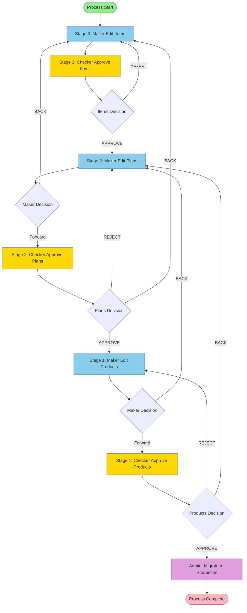
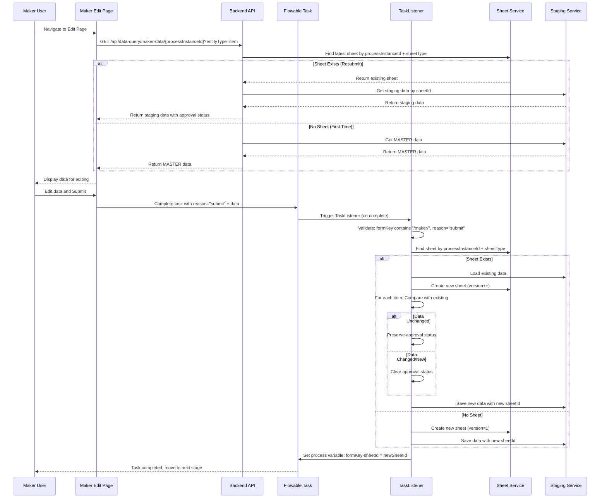
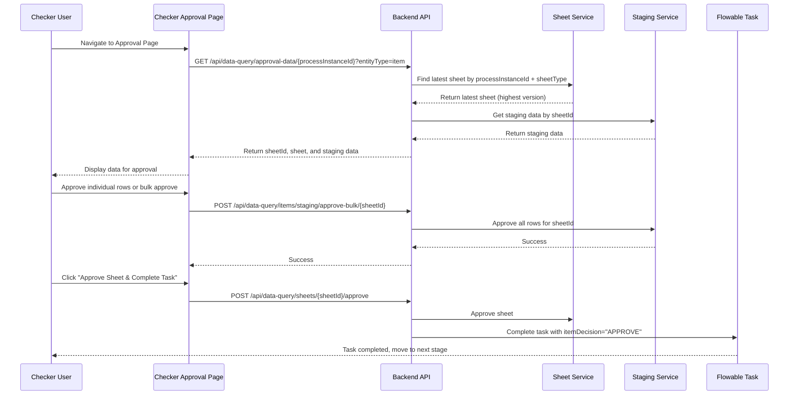
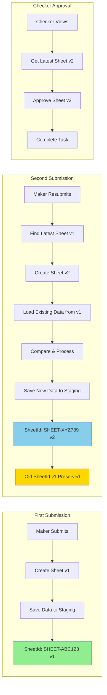
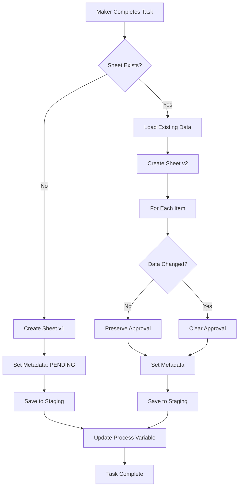
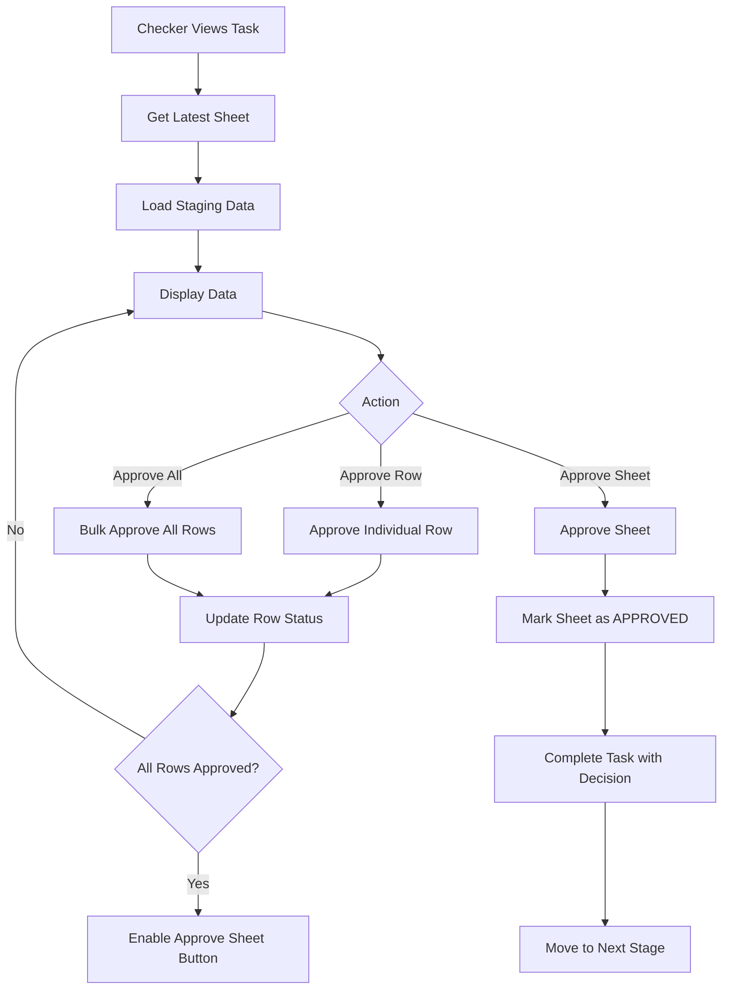

# Flowable Three-Stage Maker-Checker Workflow

## Overview

This document describes the end-to-end flow of the three-stage maker-checker approval process for Items, Plans, and Products.

---

## Process Flow Diagram



---

## Stage Details

### Stage 3: Items (First Stage)
- **Maker Task**: Edit Items (`/maker/item-edit`)
- **Checker Task**: Approve Items (`/checker/item-approval`)
- **Decision Options**: APPROVE → Stage 2, REJECT → Back to Stage 3 Maker

### Stage 2: Plans (Second Stage)
- **Maker Task**: Edit Plans (`/maker/plan-edit`)
- **Checker Task**: Approve Plans (`/checker/plan-approval`)
- **Decision Options**: 
  - APPROVE → Stage 1
  - REJECT → Back to Stage 2 Maker
  - BACK → Back to Stage 3 Maker

### Stage 1: Products (Final Stage)
- **Maker Task**: Edit Products (`/maker/product-edit`)
- **Checker Task**: Approve Products (`/checker/product-approval`)
- **Decision Options**:
  - APPROVE → Migration Task
  - REJECT → Back to Stage 1 Maker
  - BACK → Back to Stage 2 Maker

### Final: Data Migration
- **Admin Task**: Migrate Data (`/admin/data-migration`)
- **Action**: Migrates approved staging data to production tables

---

## Maker Submission Flow



---

## Checker Approval Flow



---

## Version-Based SheetId Management



### Version Logic

1. **First Submission**: Creates sheet with `version = 1`
2. **Resubmission**: 
   - Finds latest sheet for `processInstanceId + sheetType`
   - Creates new sheet with `version = latestVersion + 1`
   - Old sheet data preserved for audit trail
3. **Checker Approval**: Always works with latest version (highest version number)

---

## Data Flow: Maker Submission



---

## Data Flow: Checker Approval



---

## SheetId Version Tracking

### Database Structure

```
sheets table:
- id (PK)
- sheet_id (unique)
- process_instance_id
- sheet_type (item/plan/product)
- version (increments per submission)
- created_by
- created_at
- approved_by
- approved_at
- status (PENDING/APPROVED)
```

### Example Flow

```
Process Instance: PROC-123
Sheet Type: item

Submission 1:
  SheetId: SHEET-ABC123, Version: 1, Status: PENDING

Submission 2 (Resubmit):
  SheetId: SHEET-XYZ789, Version: 2, Status: PENDING
  (SHEET-ABC123 v1 preserved for audit)

Submission 3 (Resubmit):
  SheetId: SHEET-DEF456, Version: 3, Status: PENDING
  (SHEET-ABC123 v1, SHEET-XYZ789 v2 preserved)

Checker Approves:
  Uses SHEET-DEF456 (latest version = 3)
  Marks as APPROVED
```

---

## Key Components

### 1. Task Listeners
- **ItemTaskListener**: Handles item staging on maker submission
- **PlanTaskListener**: Handles plan staging on maker submission
- **ProductTaskListener**: Handles product staging on maker submission
- **DataMigrationTaskListener**: Handles final migration to production

### 2. Services
- **SheetService**: Manages sheet creation and versioning
- **StagingService**: Manages staging data (Item/Plan/Product)
- **DataMigrationService**: Migrates approved staging data to production

### 3. Process Variables
- `formKey-sheetId`: Stores sheetId for each stage (e.g., `/maker/item-edit-sheetId`)
- `reason`: Task completion reason ("submit" for maker tasks)
- `itemDecision`, `planDecision`, `productDecision`: Entity-based decision variables (replaces old stageXDecision)

---

## Navigation Rules

### Maker Navigation
1. User must **claim task** first from task list
2. Navigate via **formKey** button (not direct URL)
3. Can navigate **BACK** to previous stages (sets `stageXDecision = 'BACK'`)
4. **Submit** creates new sheet version

### Checker Navigation
1. User must **claim task** first from pending approvals
2. Navigate via **formKey** button
3. Can **APPROVE** (move forward), **REJECT** (send back), or **BACK** (previous stage)
4. Must approve **all rows** before approving sheet

---

## Approval Preservation Logic

When maker resubmits:

1. **Load existing data** from previous sheet version
2. **Compare** incoming data with existing data
3. **If unchanged**: Preserve approval status (approved, approvedBy, approvedAt)
4. **If changed**: Clear approval (set to PENDING)
5. **New items**: Start as PENDING

This ensures:
- Unchanged approved items remain approved
- Changed items require re-approval
- Full audit trail maintained

---

## Complete End-to-End Example

```
1. Admin starts process
   → Process Instance: PROC-123 created

2. Stage 3: Items
   → Maker claims task, edits items, submits
   → TaskListener creates Sheet v1 (SHEET-ITEM-001)
   → Data saved to item_staging table
   → Checker claims task, approves all rows, approves sheet
   → Process moves to Stage 2

3. Stage 2: Plans
   → Maker claims task, edits plans, submits
   → TaskListener creates Sheet v1 (SHEET-PLAN-001)
   → Data saved to plan_staging table
   → Checker approves, process moves to Stage 1

4. Stage 1: Products
   → Maker claims task, edits products, submits
   → TaskListener creates Sheet v1 (SHEET-PROD-001)
   → Data saved to product_staging table
   → Checker rejects, process goes back to Stage 1 Maker

5. Stage 1: Products (Resubmit)
   → Maker edits products again, submits
   → TaskListener finds existing Sheet v1
   → Creates Sheet v2 (SHEET-PROD-002)
   → Compares data, preserves approval for unchanged items
   → Checker approves, process moves to Migration

6. Migration
   → Admin migrates all approved staging data to production
   → Process completes
```

---

## Database Tables

### Staging Tables (Audit Trail)
- `item_staging`: All item submissions (preserved with sheetId)
- `plan_staging`: All plan submissions (preserved with sheetId)
- `product_staging`: All product submissions (preserved with sheetId)

### Production Tables
- `items`: Final approved items
- `plans`: Final approved plans
- `products`: Final approved products

### Sheet Management
- `sheets`: Tracks all sheet versions with version numbers

---

## Important Notes

1. **Version Increment**: Each maker submission creates a new sheet version
2. **Audit Trail**: All previous versions preserved in staging tables
3. **Latest Version**: Checker always works with latest version (highest version number)
4. **Approval Preservation**: Unchanged items keep their approval status
5. **Process Variables**: SheetId stored as `formKey-sheetId` (e.g., `/maker/item-edit-sheetId`)

