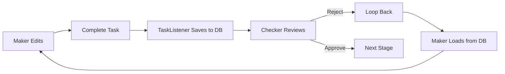

# Rejection Workflow Implementation

## Overview
Implemented complete rejection loop where Checker can send work back to Maker with feedback for corrections.

## Changes Made

### 1. **BPMN Process Flow Modified**

**Before:**
```
Maker → Checker → Gateway
                   ├─ Approve → Next Stage
                   └─ Reject → End Process ❌
```

**After:**
```
Maker → Checker → Gateway
                   ├─ Approve → Next Stage
                   └─ Reject → Loop back to Maker ✅
```

### 2. **Process Variables for Communication**

#### Variables Stored:
- `stage1Decision`: 'APPROVE' or 'REJECT'
- `stage1RejectionComments`: Checker's feedback
- `makerComments`: Maker's notes/response
- `checkerComments`: Checker's review comments
- `submittedAt`: Timestamp
- `rejectedAt`: Timestamp

### 3. **Checker View (ProductApproval.tsx)**

**What Checker Sees:**
- ✅ All products entered by Maker (via sheetId)
- ✅ Maker's comments/notes
- ✅ Previous rejection history (if resubmitted)
- ✅ Product details in table format

**Checker Actions:**
- **Approve**: Proceeds to next stage
- **Reject**: Sends back to Maker with mandatory comments
  - Must provide feedback explaining issues
  - Comments stored as `stage1RejectionComments`
  - Task loops back to `stage1MakerTask`

**UI Features:**
```tsx
{makerComments && (
  <Box sx={{ bgcolor: 'info.light' }}>
    Maker's Comments: {makerComments}
  </Box>
)}

{rejectionHistory && (
  <Box sx={{ bgcolor: 'warning.light' }}>
    Previous Rejection Comments: {rejectionHistory}
  </Box>
)}
```

### 4. **Maker View (ProductEdit.tsx)**

**What Maker Sees:**
- ✅ Existing products (persisted in database)
- ✅ Rejection feedback (if rejected)
- ✅ Visual alert with Checker's feedback
- ✅ Comments field to respond

**When Task Returns After Rejection:**
```tsx
{rejectionComments && (
  <Alert severity="warning">
    <strong>Checker's Feedback - Please Address:</strong>
    {rejectionComments}
  </Alert>
)}
```

**Maker Actions:**
- Edit/add/delete products
- Add response comments explaining corrections
- Submit for re-approval

### 5. **Data Persistence**

#### How Data is Preserved:
1. **First Submission**: Maker completes task → ProductTaskListener saves products to DB
2. **Rejection**: Checker rejects → sheetId preserved in process variables
3. **Loop Back**: Maker gets same task → loads products by sheetId from DB
4. **Modification**: Maker edits → ProductTaskListener updates DB
5. **Resubmission**: Maker completes → Checker sees updated data



### 6. **Workflow Example**

#### Scenario: Product Rejected for Price Error

**Round 1:**
1. Maker creates product with rate=100
2. Adds comment: "Standard pricing applied"
3. Submits → ProductTaskListener saves
4. Checker sees product with rate=100
5. Checker rejects: "Rate should be 150 per policy XYZ"
6. Task loops back to Maker

**Round 2:**
7. Maker sees warning alert: "Rate should be 150 per policy XYZ"
8. Maker edits product: rate=150
9. Adds response: "Corrected rate to 150 as per policy XYZ"
10. Resubmits → ProductTaskListener updates DB
11. Checker sees:
    - Updated product with rate=150
    - Previous rejection: "Rate should be 150 per policy XYZ"
    - Maker's response: "Corrected rate to 150 as per policy XYZ"
12. Checker approves → Proceeds to Stage 2

## Technical Implementation

### BPMN Changes
```xml
<!-- Before -->
<sequenceFlow id="flow5" sourceRef="stage1Gateway" targetRef="endEventRejected">
    <conditionExpression>${stage1Decision == 'REJECT'}</conditionExpression>
</sequenceFlow>

<!-- After -->
<sequenceFlow id="flow5" sourceRef="stage1Gateway" targetRef="stage1MakerTask">
    <conditionExpression>${stage1Decision == 'REJECT'}</conditionExpression>
</sequenceFlow>
```

### Frontend Changes

**Checker Complete Task:**
```typescript
await flowableApi.completeTask(taskId, {
  checkerComments: comments,
  checkerDecision: 'REJECT',
  stage1Decision: 'REJECT',
  stage1RejectionComments: comments, // For maker to see
  rejectedAt: new Date().toISOString()
})
```

**Maker Load Rejection:**
```typescript
const response = await flowableApi.getTaskVariables(taskId)
if (response.stage1RejectionComments) {
  setRejectionComments(response.stage1RejectionComments as string)
}
```

**Maker Resubmit:**
```typescript
await flowableApi.completeTask(taskId, {
  products: products,
  sheetId,
  makerComments: makerResponse, // Response to rejection
  stage1Decision: 'COMPLETE',
  submittedAt: new Date().toISOString()
})
```

## Benefits

### 1. **Complete Communication Loop**
- Checker provides clear feedback
- Maker understands what to fix
- Bidirectional conversation via comments

### 2. **Data Integrity**
- All data persisted in database
- sheetId tracks data across loops
- No data loss during rejection cycles

### 3. **Audit Trail**
- Rejection history preserved
- Timestamps tracked
- Comments logged

### 4. **User Experience**
- Visual alerts for important feedback
- Clear workflow state
- Helpful placeholders and hints

## Next Steps

Apply the same pattern to:
1. ✅ Stage 1: Products - DONE
2. ⏳ Stage 2: Plans - TODO
3. ⏳ Stage 3: Items - TODO

Each stage needs:
- Updated rejection comments handling
- Visual feedback displays
- Response comment fields
- Process variable storage (`stage2RejectionComments`, `stage3RejectionComments`)

